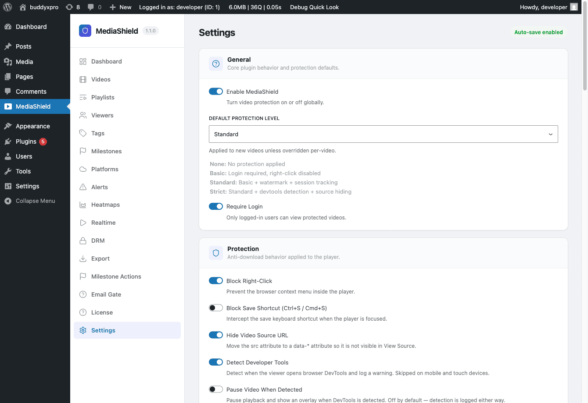

# Settings Overview

*The MediaShield Settings page. All options auto-save on change - no Save button required.*

All MediaShield settings live under **MediaShield > Settings**. Changes auto-save as you make them - there is no Save button to click.

Settings are divided into sections:

| Section | What it controls |
|---------|-----------------|
| General | Master switch, default protection level, login requirement, badge display |
| Watermark | Overlay opacity, color, and position swap interval |
| Access Control | Concurrent streams, allowed domains, login overlay text |
| Upload | Maximum upload file size for self-hosted videos |
| Custom URL Patterns | Additional video embed patterns for auto-detection |
| Player Controls | Speed control, sticky player, keyboard shortcuts, resume, end screen |
| Protection Controls | Right-click blocking, keyboard blocking, source hiding, developer-tools detection |

## General Settings

**Enable MediaShield** - The master on/off switch. When off, no protection runs and no sessions are tracked site-wide. Use this for maintenance, not as a permanent setting.

**Default Protection Level** - Baseline protection applied to any video that has no per-video override.

- None - No protection.
- Basic - Right-click disabled, source URL hidden from page source.
- Standard - Basic plus dynamic watermark and developer-tools detection.
- Strict - Standard plus keyboard shortcut blocking and a fullscreen watermark.

**Require Login** - Forces viewers to log in before any video plays. Turn this off only if you want some videos publicly viewable. Individual videos can override this via the Access Role setting.

**Show Badge** - Displays a "Protected by MediaShield" badge on the player. Toggle off for a cleaner look. Works in both free and Pro.

## Watermark Settings

The watermark is a text overlay that appears on top of the video while it plays. It shows the viewer's display name and IP address so you can trace any leaked recording back to the source.

**Opacity** - How visible the overlay is (0-100%). Values around 30-50% are visible without being distracting.

**Color** - Watermark text color. Use a color that is readable against your typical video content.

**Swap Interval** - How often the watermark moves to a new position (seconds). Shorter intervals make the watermark harder to crop out consistently.

The free watermark shows display name and IP. Pro extends this to 7 configurable fields.

## Access Control

**Max Concurrent Streams** - How many devices one account can use simultaneously. Default is 2. When a viewer tries to open a third stream, they see an error until they close another.

**Allowed Domains** - Comma-separated domains that may embed your videos. Leave empty to allow embeds from any domain. When a list is set, requests with a missing Referer header are denied by default.

**Login Overlay Text** - The message shown when a visitor tries to watch but is not logged in.

**Login Button Text** - The label on the login button in the overlay.

**Access Denied Text** - Shown when a logged-in user does not have the required role for a specific video.

## Upload Settings

**Max Upload Size** - The largest file a user with upload permission can upload in one go. Default is 500 MB. Self-hosted videos are stored in your WordPress uploads folder in a protected subfolder.

## Custom URL Patterns

Add extra URL patterns for MediaShield's automatic video detection. Use this when you embed videos from a host that MediaShield does not recognize automatically. Add one pattern per line.

## Player Controls and Protection Controls

These are covered in detail in their own pages:

- [Player Settings](03-player-settings.md)
- [Protection Settings](02-protection-settings.md)
