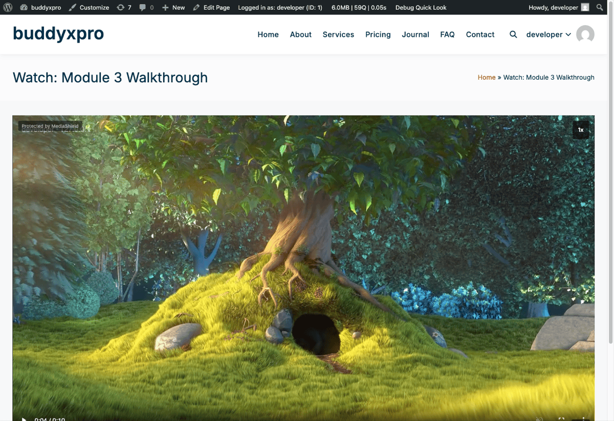

# Introduction to MediaShield

*A protected video in the frontend player. The dynamic watermark and "Protected by MediaShield" badge are visible during playback.*

MediaShield is a WordPress plugin that adds a protection and analytics layer on top of your videos. Version 1.3.0.

It works with videos hosted on YouTube, Vimeo, Bunny Stream, Wistia, or your own server. Once a video is registered in MediaShield, the plugin wraps it in a protected player that adds:

- A dynamic watermark showing the viewer's identity on every frame
- Login and role-based access control
- Concurrent stream limiting (one account, limited devices)
- Session tracking: how long each viewer watched, how far they got, and which milestones they reached
- Developer-tools detection and right-click blocking
- Playlist support with autoplay and countdown

## What MediaShield is for

MediaShield is built for online course creators, membership site owners, and anyone delivering video to a paying or gated audience on WordPress. The typical use case is a course or training library where you want to:

1. Make sure only paying members can watch
2. Know who watched what and for how long
3. Be able to trace any leaked recording back to the viewer
4. Limit account sharing

## What MediaShield does not promise

No WordPress video plugin can block screen recording. MediaShield makes recordings traceable - not impossible to make. The dynamic watermark shows the viewer's display name, plus their IP address when the player is wide enough to fit it, on every frame. If content leaks, you know who was watching. This is the right model for WordPress-native video protection at this price point.

Two further limits are worth knowing up front:

- **Self-hosted files depend on your web server.** Videos uploaded to MediaShield are stored in `wp-content/uploads/mediashield/`. MediaShield writes an `.htaccess` deny rule there, but `.htaccess` is an Apache feature and nginx ignores it. On nginx those files stay directly downloadable until you add a matching rule to your server config. MediaShield tests this on your actual host and gives you the rule under **Tools > Site Health**. See [Troubleshooting](../using-mediashield/04-troubleshooting.md).
- **Platform embeds always carry their own IDs.** YouTube, Vimeo, Wistia, and Bunny videos play inside the provider's iframe, and that iframe URL necessarily contains the provider's video ID. "Hide Video Source URL" therefore applies to self-hosted video only.

## Free vs Pro

The free plugin ships a complete protection and analytics layer. MediaShield Pro adds features that go beyond the baseline:

| Feature | Free | Pro |
|---------|------|-----|
| Dynamic watermark (name + IP) | Yes | Yes, with 7 configurable fields |
| Login and role access control | Yes | Yes |
| Concurrent stream limit | Yes | Yes |
| Session tracking and milestones | Yes | Yes |
| Playlists | Yes | Yes |
| In-video ad breaks | Yes | Yes |
| Analytics dashboard | Yes | Yes (plus heatmaps, realtime, and alerts) |
| Right-click and devtools protection | Yes | Yes |
| Platform API connections (Bunny, YouTube, Vimeo, Wistia) | No | Yes |
| ClearKey DRM for self-hosted video (experimental) | No | Yes |
| LMS integrations (LearnDash, LifterLMS, TutorLMS) | No | Yes |
| Data export (CSV, PDF) | No | Yes |
| Suspicious activity alerts | No | Yes |

DRM is marked experimental deliberately. Before 1.3.0 it could not be switched on at all - nothing in the admin was able to store the `drm` protection level, so the whole feature was unreachable. It is selectable from 1.3.0 onward, but playback has not been verified end to end across browsers. Treat it as a preview, not a shipping guarantee.

## Requirements

- WordPress 6.5 or higher
- PHP 8.1 or higher
- A modern browser for the admin (Chrome, Firefox, Safari, Edge)

## Where to go next

- [Installation](02-installation.md) - install and activate the plugin
- [Setup Wizard](03-setup-wizard.md) - configure on first run
- [Add Your First Video](04-add-your-first-video.md) - register and embed a video
