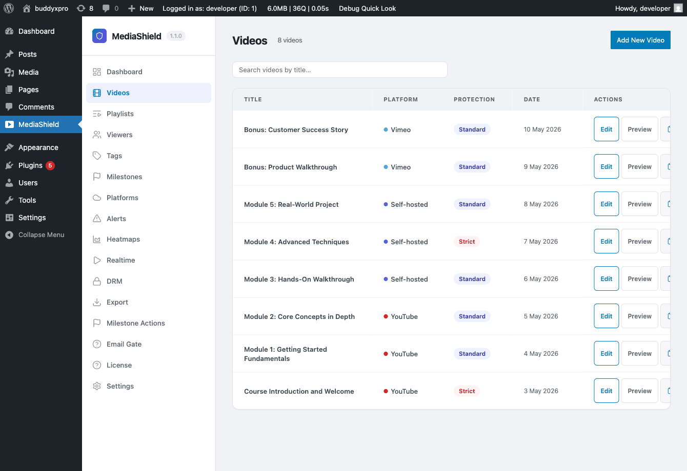

# Add Your First Video

After completing the setup wizard, you're ready to register and embed your first protected video.

## Step 1 - Create a video in the library


*The Videos list in the MediaShield admin. Each row shows the platform, protection level badge, and video status.*

Go to **MediaShield > Videos** and click **Add New Video**.

Fill in the fields:

**Platform** - Choose where the video is hosted: Self-hosted, YouTube, Vimeo, Bunny, or Wistia.

**Source URL or Video ID** - Paste the video URL. MediaShield extracts the platform's video identifier from the URL and stores it alongside the original URL.

**Protection Level** - Set a per-video override, or leave empty to use the site-wide default from Settings.

- **None** - No protection for this video.
- **Basic** - Right-click disabled, source URL hidden.
- **Standard** - Basic plus dynamic watermark and developer-tools detection.
- **Strict** - Standard plus keyboard shortcut blocking and a fullscreen watermark.

**Access Role** (optional) - Restrict playback to a specific WordPress role. Leave blank to allow all logged-in users.

**Per-video player controls** - Override global player defaults for this video: speed control, sticky player, keyboard shortcuts, playback resume, and end screen.

Click **Save**. The video is now in your library.

> Note on platform API features: the free plugin plays embedded videos from YouTube, Vimeo, Wistia, and Bunny via their normal iframes, with the MediaShield wrapper around them. Browsing, importing, or uploading through a platform's own API requires MediaShield Pro.

## Step 2 - Embed the video

Once the video is in your library, you have three ways to embed it on a page or post.

### Block editor (Gutenberg)

In the block inserter, search for **MediaShield Video**. The block opens a video picker where you select the video you just created. You can also paste a fresh video URL directly into the block to create a library entry on the fly. The editor shows a live preview. The frontend output includes the player, watermark, session tracking, and the login overlay when required.

### Shortcode

Drop this into post content, a page builder widget, or any text area:

```
[mediashield id=42]
```

Replace `42` with the ID number of your video. You can find the ID in the video list - it appears as the post ID in the edit URL. Invalid or unpublished IDs render nothing.

### "My Videos" shortcode

Build a member dashboard or course completion page with:

```
[mediashield_my_videos]
```

This renders a grid of every video the current logged-in user has watched, with completion progress bars. It shows nothing for visitors who are not logged in.

## Step 3 - Test the embed

Open the page in a browser where you are logged in. You should see:

- The video player with the protection layer
- A watermark overlay showing your display name and IP address (if protection level is Standard or higher)
- The "Protected by MediaShield" badge (if enabled in Settings)

Watch the video for at least 30 seconds, then check **MediaShield > Dashboard**. You'll see the session counted and the activity chart updated.

## Setting a thumbnail

**Platform videos** (YouTube, Vimeo, Wistia, Bunny) - MediaShield pulls the poster the platform generated and sets it as the WordPress Featured Image when the video is saved. Nothing to do.

**Self-hosted videos** - MediaShield does not auto-generate a thumbnail from your uploaded file. Set the **Featured Image** on the video edit screen manually. That image is used as the poster frame in the player, video lists, blocks, and playlists.

## Next steps

- [Settings Overview](../configuration/01-settings-overview.md) - tune protection, player, and access control
- [Shortcodes and Blocks](../configuration/05-shortcodes-and-blocks.md) - full embed reference
- [Watermarks](../using-mediashield/01-watermarks.md) - how the watermark works
- [Analytics and Milestones](../using-mediashield/02-analytics-and-milestones.md) - reading the dashboard
