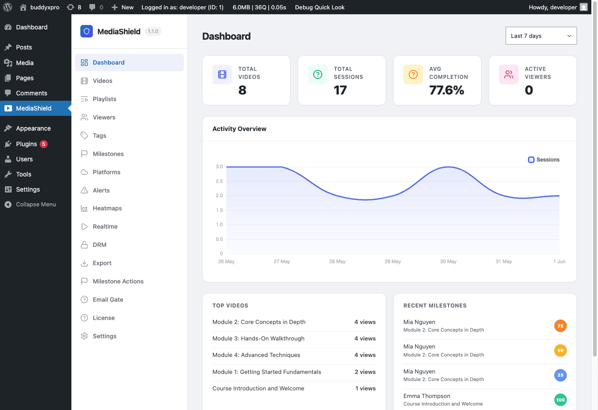
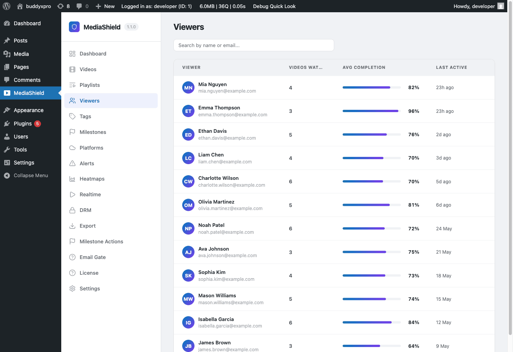
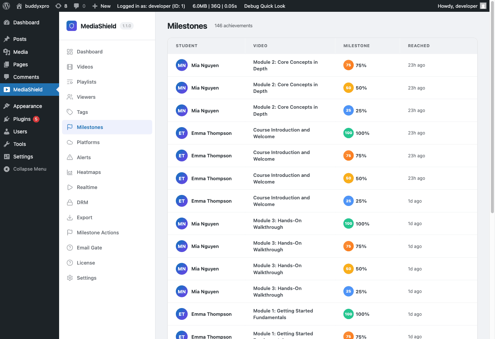

# Analytics and Milestones

Analytics only exist for videos at **Standard** or **Strict** protection level. Those are the levels that start a watch session. Videos set to None or Basic play without recording anything, and never appear in any of the screens below.

## The Dashboard


*The MediaShield Dashboard. The daily activity chart, Top Videos, and Recent Milestones all follow the selected date range.*

Go to **MediaShield > Dashboard** to see your analytics overview.

The date range selector at the top offers Today, Last 7 days (the default), Last 30 days, and Last 90 days. "Today" means the last 24 hours. Daily bars in the chart are grouped by your WordPress site timezone, so late-evening sessions land on the right calendar day.

### Stat cards

- **Total Videos** - published videos in your library. Not affected by the date range.
- **Total Sessions** - watch sessions started in the selected period.
- **Avg Completion** - average completion percentage across sessions in the period that made any progress at all. Sessions at 0% are excluded so an accidental page load does not drag the average down.
- **Active Viewers** - distinct viewers with a heartbeat in the last 5 minutes. This is live, and ignores the date range.

### Activity chart

A daily bar chart of session counts over the selected period.

### Top Videos

The five best-performing videos by session count for the active date range, with each one's average completion.

### Recent Milestones

The most recent milestones reached across all videos, within the same date range as the rest of the dashboard.

## Per-viewer analytics


*The Viewers page. Each row shows a viewer's average completion and last active time. Click a row for their watch history.*

Go to **MediaShield > Viewers** to see per-user watch activity. (This section was called Students in earlier versions; old links still resolve.)

The list shows every user who has watched at least one video, with videos watched, average completion, and last active time, and a search box for name or email.

Click a viewer to see their watch history: every video they have started, their progress, and when they last watched it. The detail view covers their 100 most recent sessions.

This is the page to open when a learner says their progress did not register. If their video is set to Basic or None, nothing was ever recorded, and that is the answer.

## Milestones


*The Milestones page. A paginated log of who reached which threshold, and when.*

**MediaShield > Milestones** is a log, not a settings screen. It lists each milestone that has been reached - viewer, video, percentage, and how long ago - newest first, 20 per page.

By default MediaShield records four thresholds per video: 25%, 50%, 75%, and 100%. Each one is recorded once per viewer per video, so re-watching does not double-count. Developers can change the set with the `mediashield_milestone_thresholds` filter.

### Milestone tags

Milestone tags are configured **on the video**, not on the Milestones page. Open a video and use the Milestone Tags box: it offers 10%, 25%, 50%, 75%, and 100%, each with a tag name and an Active checkbox. Enabling a threshold here also makes that threshold tracked for the video, which is how 10% becomes available.

When a viewer crosses an enabled threshold:

1. The tag is created in the Tags library if it does not exist yet
2. The tag is linked to the video
3. An earn record - video, percentage, tag, and timestamp - is written to that viewer's user profile

Pro can act on the same moment to send email, fire webhooks, or apply CRM tags.

### Milestone hooks for custom integrations

The free plugin fires PHP actions when milestones are reached, so you can wire your own logic. For example, mark a LearnDash lesson complete when a video reaches 100%:

```php
add_action( 'mediashield_milestone_100', function( $user_id, $video_id ) {
    // Your LMS integration code here
}, 10, 2 );
```

The `mediashield_milestone_reached` action fires for all percentages and passes the percentage as a parameter. There are also percentage-specific actions: `mediashield_milestone_25`, `mediashield_milestone_50`, `mediashield_milestone_75`, `mediashield_milestone_100`.

For the full action signatures, see the [Developer Guide - Hooks and Filters](../developer-guide/02-hooks-and-filters.md).

## Tags

Go to **MediaShield > Tags** to manage the tag dictionary. The table lists each tag's name, slug, and how many videos carry it.

You can add a tag by name and delete tags you no longer want. Deleting a tag also removes it from every video. Renaming is not available in the admin in this release; the REST API supports it (`PUT /wp-json/mediashield/v1/tags/{id}`).

Tags arrive here two ways: created by hand on this page, or created automatically the first time a viewer earns a milestone tag. Deleting a video removes its tag links, and any tag left attached to no videos is removed with it.

## What to expect on a fresh install

The dashboard shows real data only. There are no demo numbers. After installing, watch a video as a logged-in user for at least 30 seconds, then refresh the dashboard to see your first session counted. If nothing appears, check the video's protection level before anything else.
